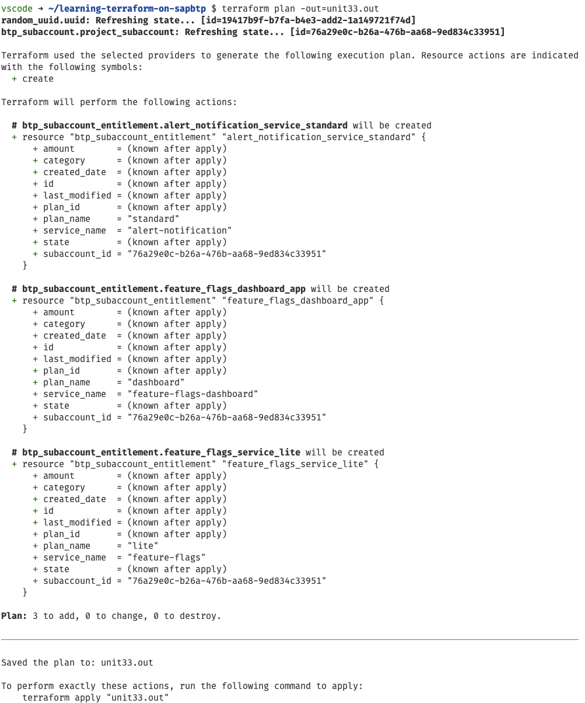
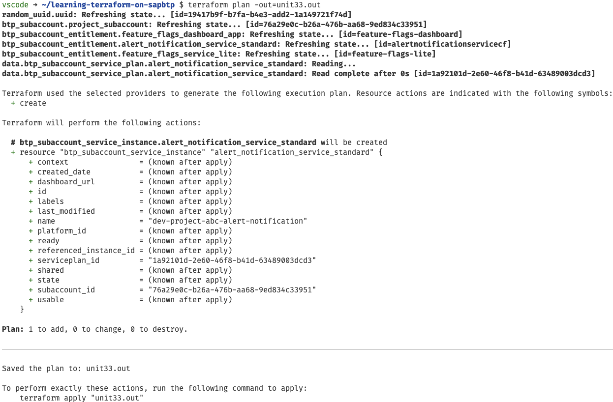
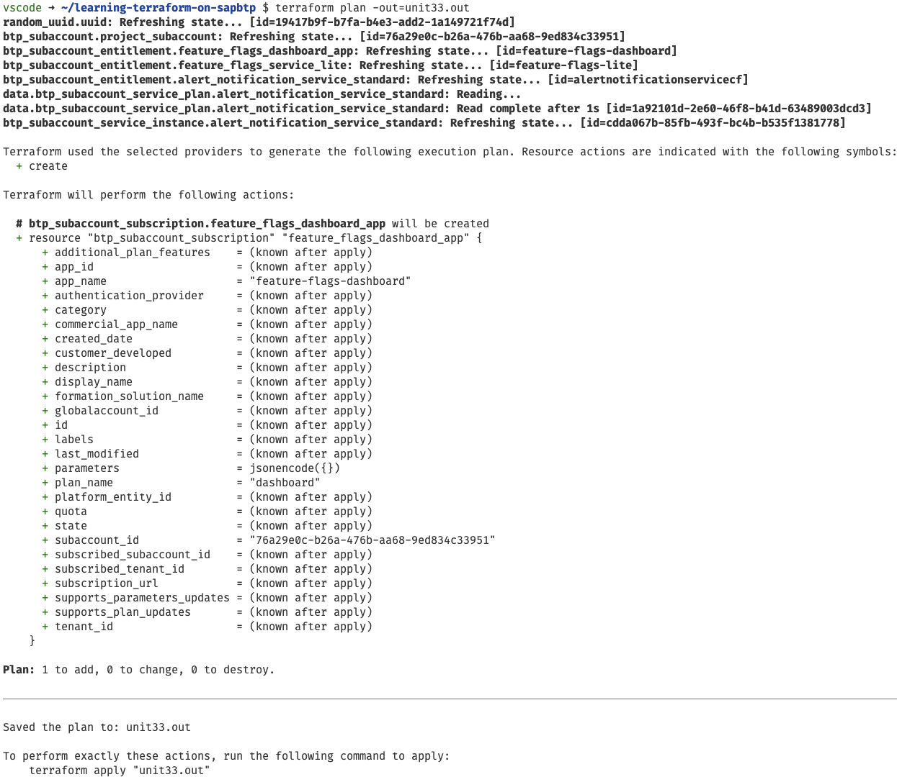

# Unit 3 Lesson 3 - Adding Multiple Resources to the Terraform Configuration

## Goal 🎯

The goal of this unit is to add additional resources to out configuration. In addition we will see how to make use of *data sources* and manage *explicit dependencies* between resources.

## Adding entitlements, subscriptions and service instances 🛠️

### The backlog of resources

Up to now we have configured a new subaccount. Now we want to add some more resources to it namely:

- Entitlements for the alert-notification service, the feature-flag service as well as the feature-flag dashboard application
- A service instance of the alert-notification service
- A subscription of the feature-flag dashboard application

Some stuff to do, but we can manage that step by step. We already know that we find these resources in the Terraform documentation, so let us get started

### Adding entitlements

As we want to add entitlements in our newly created subaccount, the fitting resource is [`btp_subaccount_entitlement`](https://registry.terraform.io/providers/SAP/btp/latest/docs/resources/subaccount_entitlement).

Looking at the required attributes we see that we basically need the `subaccount_id`, the `service_name` and the `plan_name`. The list of services does not have a numerical quota, so that's all we need.

However, one question is where we get the ID of the subaccount from. The answer to that one is directly from the resource that we defined as it contains all fields including the computed ones as we see in the documentation of the resource [btp_subaccount](https://registry.terraform.io/providers/SAP/btp/latest/docs/resources/subaccount).

> [!TIP]
> You can also do a check via `terraform show` to see what is available in the state.

Let us add the entitlements by adding the following code to our `main.tf` file:

```terraform
resource "btp_subaccount_entitlement" "alert_notification_service_standard" {
  subaccount_id = btp_subaccount.project_subaccount.id
  service_name  = "alert-notification"
  plan_name     = "standard"
}

resource "btp_subaccount_entitlement" "feature_flags_service_lite" {
  subaccount_id = btp_subaccount.project_subaccount.id
  service_name  = "feature-flags"
  plan_name     = "lite"
}

resource "btp_subaccount_entitlement" "feature_flags_dashboard_app" {
  subaccount_id = btp_subaccount.project_subaccount.id
  service_name  = "feature-flags-dashboard"
  plan_name     = "dashboard"
}
```

This should give us the entitlements that we need. Let us apply this change to our subaccount. First we make sure that our code is nicely formatted and execute:

```bash
terraform fmt
```

and

```bash
terraform validate
```

No issues found, then we do the planning

```bash
terraform plan -out=unit33.out
```

The output should look like this:



Three resources to be added, that is what we expected. We can apply the plan via:

```bash
terraform apply "unit33.out"
```

The output should look like this:


That worked like a charm. We can of course inspect the state and jump to the cockpit to verify that everything is place.

> [!TIP]
> If you make changes to a configuration, we recommend to avoid big bang approaches but move forward in smaller chunks. This makes it easier to analyze and fix potential errors.

Let us move on to the service instance.

### Adding a service instance

We already know the drill: first we take a look at the documentation to find the fitting resource, in this case [`btp_subaccount_service_instance`](https://registry.terraform.io/providers/SAP/btp/latest/docs/resources/subaccount_service_instance).

Taking a closer look at the [example usage](https://registry.terraform.io/providers/SAP/btp/latest/docs/resources/subaccount_service_instance#example-usage) section, we see that we need a service plan ID to create a service instance. That makes sense, but where to we get this from?

Maybe the entitlements already contain this field, at least there is something promising mentioned in the [documentation](https://registry.terraform.io/providers/SAP/btp/latest/docs/resources/subaccount_entitlement) namely the field `plan_id`. Let us check what is in the state by executing:

```bash
terraform state show btp_subaccount_entitlement.alert_notification_service_standard
```

The result is:

```terraform
# btp_subaccount_entitlement.alert_notification_service_standard:
resource "btp_subaccount_entitlement" "alert_notification_service_standard" {
    amount        = 1
    category      = "ELASTIC_SERVICE"
    created_date  = "some date"
    id            = "alertnotificationservicecf"
    last_modified = "some date"
    plan_id       = "alertnotificationservicecf"
    plan_name     = "standard"
    service_name  = "alert-notification"
    state         = "OK"
    subaccount_id = "..."
}
```

That does not look like the technical ID that we need for the service instance creation. What other options do we have?

The Terraform provider offers besides the resources also so called [*data sources*](https://developer.hashicorp.com/terraform/language/data-sources). Data sources are provided to read data from real-world resources on the platform and use the data in the Terraform configuration.

Indeed there is a data source that should help us namely [`btp_subaccount_service_plan`](https://registry.terraform.io/providers/SAP/btp/latest/docs/data-sources/subaccount_service_plan) which allows us to read the data for a service plan by plan name and offering name.

> [!TIP]
> The real-word resources read via data sources do not need to be managed via Terraform. This is also the reason why the Terraform provider for SAP BTP has data sources for parts of the SAP BTP that cannot be managed via the resources e.g., entitlements on global account level.

With these two ingredients we can implement the configuration by adding the following code to the `main.tf` file:

```terraform
data "btp_subaccount_service_plan" "alert_notification_service_standard" {
  subaccount_id = btp_subaccount.project_subaccount.id
  name          = "standard"
  offering_name = "alert-notification"
}

resource "btp_subaccount_service_instance" "alert_notification_service_standard" {
  subaccount_id  = btp_subaccount.project_subaccount.id
  serviceplan_id = data.btp_subaccount_service_plan.alert_notification_service_standard.id
  name           = "${local.service_name_prefix}-alert-notification"
}
```

First we read the service plan ID via the data source specified with the `data` block. We use this information in the corresponding `resource` block that provisions the service instance. To have a consistent naming of the service instances we want to use a prefix that we define in the `locals` block. We add the following code to this block:

```terraform
service_name_prefix  = lower(replace("${var.subaccount_stage}-${var.project_name}", " ", "-"))
```

Everything should be in place now for the creation of the service instance provisioning. But let us do a check:

- We entitled the subaccount
- We looked up the technical ID of the service plan
- We provision the service instance

This is the sequence in which the actions must be executed. How does Terraform know about that? Let us take a look at the handling of dependencies in the next section.

### Handling of dependencies

The provisioning of resources by Terraform is executed in parallel. By default 10 resources are provisioned in parallel. When setting up the execution plan Terraform will consider dependencies between resources if it can detect them. The detection is possible whenever an attribute of a resource is used by another resource as attribute value.

Looking at our configuration we see that the ID of the subaccount `btp_subaccount.project_subaccount.id` is used all over the place. Consequently, Terraform knows that it must provision the `btp_subaccount` resource first, before working on the other resources that use the ID.

However, there is no such connection between the entitlement and the data source for the service plan. Here we must tell Terraform there is a *explicit dependency* that it must take into account when creating the execution plan. We achieve this by the meta argument [`depends_on`](https://developer.hashicorp.com/terraform/language/meta-arguments/depends_on). In this argument we can specify the address of the resource that the annotated resource depends on. In our case we modify the code for the data source in the `main.tf`:

```terraform
data "btp_subaccount_service_plan" "alert_notification_service_standard" {
  subaccount_id = btp_subaccount.project_subaccount.id
  name          = "standard"
  offering_name = "alert-notification"
  depends_on    = [btp_subaccount_entitlement.alert_notification_service_standard]
}
```
We added the `depends_on` meta argument and now Terraform knows that the resource for the entitlement must be executed successfully before the data source can be executed. The service instance resource depends on the data source due to the service plan ID, so the execution sequence is we want it to be.

> [!NOTE]
> In general, Terraform treis to execute all data sources right at the beginning of a Terraform execution.

Now we are set and can apply the changes. Of course, we first make sure that the code is formatted and validated, right 😉.

```bash
terraform fmt
terraform validate
```

No issues found, then let's plan the change and overwrite the existing plan file:

```bash
terraform plan -out=unit33.out
```

This should result in:



Looks good, let's apply things then:

```bash
terraform apply "unit33.out"
```

We should see an output like this:


Great, only one more thing to do, subscribing to the application.

### Adding a subscription

We are experts in the meanwhile when it comes to adding resources. A subscription is covered by the resource [btp_subaccount_subscription ](https://registry.terraform.io/providers/SAP/btp/latest/docs/resources/subaccount_subscription).

In contrast to the service instance we can provide the plan via its name, so no data source needed in this case but we must not forget the dependency to the entitlement.

We add the following code to the `main.tf`:

```terraform
resource "btp_subaccount_subscription" "feature_flags_dashboard_app" {
  subaccount_id = btp_subaccount.project_subaccount.id
  app_name      = "feature-flags-dashboard"
  plan_name     = "dashboard"
  depends_on    = [btp_subaccount_entitlement.feature_flags_dashboard_app]
}
```

And another round of formatting and validating:

```bash
terraform fmt
terraform validate
```

Then we do the planning:

```bash
terraform plan -out=unit33.out
```

The result should look like this:



And with that we apply the change to our subaccount:

```bash
terraform apply "unit33.out"
```

The result should look like this:


What a ride, but we made it. We added entitlements, create a service instance as well as an app subscription in our subaccount.

## Summary 🪄

We introduced several new resources. Through the course of provisioning these resources we also made use of data sources to fetch information from the SAP BTP and learned about dependency management of Terraform as well as how to define explicit dependencies.

With that let us continue with [Unit 3 Lesson 4 - Setting up a Cloud Foundry environment via Terraform](../lesson_4/README.md)

## Sample Solution 🛟

You find the sample solution in the directory `units/unit_3/lesson_3/solution_u3_l3`.

## Further References 📝

-  [Handling explicit dependencies](https://developer.hashicorp.com/terraform/language/meta-arguments/depends_on)
