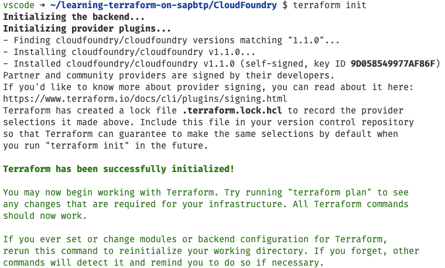
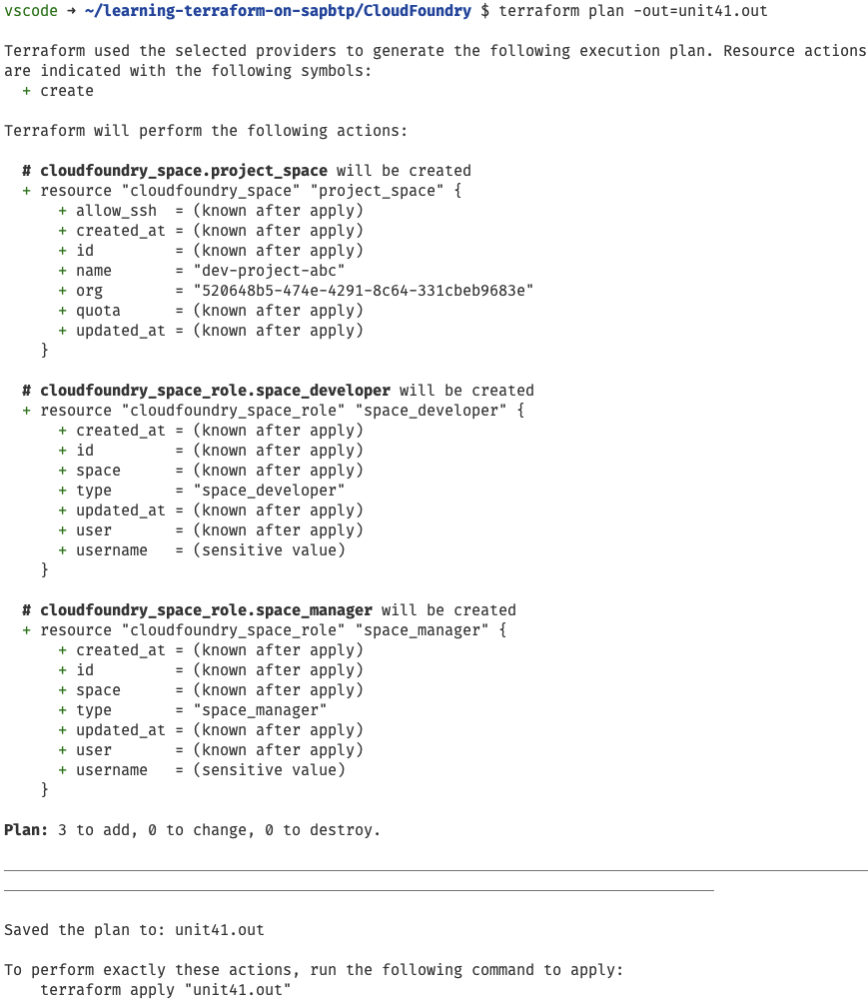

# Unit 4 Lesson 1 - Enhancing the Setup with Additional Providers

## Goal 🎯

The goal of this unit is to add a *Cloud Foundry* space to the setup as well as assign different roles on space level. To achieve this we will make use of an additional Terraform provider

## Bringing in the Cloud Foundry provider 🛠️

### Multi-provider setup

Taking a look at the Terraform provider for SAP BTP, we see that the coverage of the provider is restricted to the SAP BTP resources. This is by intention to keep the responsibility of the provider well-defined. But SAP BTP offers more than pure SAP BTP resources, namely a Cloud Foundry environment with its specific resources as well as a Kyma environment based on Kubernetes. Can we cover the setup of these environments with Terraform. We can, Terraform enables a multi-provider setup enabling us to combine several providers in a configuration.

For SAP BTP the following two providers are of relevance for the runtimes:

- [The Terraform provider for Cloud Foundry](https://registry.terraform.io/providers/cloudfoundry/cloudfoundry/latest) provided by the Cloud Foundry Foundation
- [The Terraform provider for Kubernetes](https://registry.terraform.io/providers/hashicorp/kubernetes/latest) provided by Hashicorp

As we created a Cloud Foundry environment in the previous unit, we will focus on the Cloud Foundry provider in this course.

As we are starting from scratch, the first thing we need to do is set up the provider configuration.

To complete the setup in Cloud Foundry, we will add the following resources:

- A Cloud Foundry space following the same naming conventions as the Cloud Foundry organization
- Add us as a user to the space with the roles `space_manager` and `space_developer`

### Cloud Foundry provider configuration

Following the [provider documentation](https://registry.terraform.io/providers/cloudfoundry/cloudfoundry/latest/docs) we see that we need the Cloud Foundry API URL for the provider configuration. We got this information from the environment instance we created in the previous unit. That is good.

However there is one downside of the provider configuration that comes into our way here: the configuration can only consist of static values that are known from the start. While we could provide this value as a variable there is currently no way to provide this value dynamically during Terraform execution. Consequently, we must split the configuration and add a dedicated new provider setup for the Cloud Foundry specifics.

> [!NOTE]
> This downside is not specific for the setup on SAP BTP, but is also the case for other cloud providers. In the case of Kubernetes it is even recommended to split the provisioning of the cluster from further action in the cluster to avoid unwanted side effects.

To separate the Terraform configuration for Cloud Foundry, we restructure our setup a bit. We create two new directories inside of our existing directory `learning-terraform-on-sapbtp`:

- `BTP` - This directory will contain all the configuration for *BTP specific* resources
- `CloudFoundry` - This directory will contain all the configuration for *Cloud Foundry specific* resources

We move all the configuration including the `*.tfstate` file as well as the `.terraform` directory and the `.terraform.lock.hcl` file into the `BTP` directory. The directory `learning-terraform-on-sapbtp` should now only contain the two new directories.

We switch into the directory `CloudFoundry`. We create a new file called `provider.tf` in the newly created directory with the following content:

```terraform
terraform {
  required_providers {
    cloudfoundry = {
      source  = "cloudfoundry/cloudfoundry"
      version = "1.5.0"
    }
  }
}

provider "cloudfoundry" {
  api_url = var.cf_api_url
}
```

We save the change and create another file called `variables.tf` to define the variable for the Cloud Foundry API endpoint by adding the following code:

```terraform
variable "cf_api_url" {
  description = "The Cloud Foundry API URL"
  type        = string
}
```

With the basic provider configuration in place, we must add the necessary information for authentication. According to the *Note* section of the provider [documentation](https://registry.terraform.io/providers/cloudfoundry/cloudfoundry/latest/docs#schema) we can provide username and password as environment variables as we already did it for the Terraform provider for SAP BTP depending on your operating system:

- On Windows:

   ```pwsh
   $env:CF_USER=<MY SAP BTP USERNAME>
   $env:CF_PASSWORD=<MY SAP BTP PASSWORD>
   ```
- On MacOS and Linux:

   ```bash
   export CF_USE=<MY SAP BTP USERNAME>
   export CF_PASSWORD=<MY SAP BTP PASSWORD>
   ```

As an alternative on MacOS and Linux you can also create a new file called `.env` with the following content

```text
CF_USER='MY SAP BTP USERNAME'
CF_PASSWORD='MY SAP BTP PASSWORD'
```

You can then export the two values in one go via:

```bash
export $(xargs < .env)
```

Having this in place, we can continue and add the resources.

### Adding a Cloud Foundry space

First we add a Cloud Foundry space. The resource for that is [`cloudfoundry_space`](https://registry.terraform.io/providers/cloudfoundry/cloudfoundry/latest/docs/resources/space). We see that we need at least the ID of the Cloud Foundry organization that we can get from the output of the setup on SAP BTP. We also must provide a name which should follow the same naming conventions as the organization set up in the previous unit.

Let's do one step after the other. First we add the necessary variables to the `variables.tf` file:

```terraform
variable "cf_org_id" {
  description = "The Cloud Foundry organization ID"
  type        = string
}

variable "project_name" {
  description = "Name of the project"
  type        = string
  default     = "Project ABC"
}

variable "subaccount_stage" {
  description = "Stage of the subaccount"
  type        = string
  default     = "DEV"
  validation {
    condition     = contains(["DEV", "TEST", "PROD"], var.subaccount_stage)
    error_message = "Stage must be one of DEV, TEST or PROD"
  }
}
```

As we will provide them based on the output of the previous setup we create a new file called `terraform.tfvars` and add the values for the Cloud Foundry API URL and the organization ID from the previous unit as values.

> [!TIP]
> You can use the `terraform output` command to get access to the values.

The `terraform.tfvars` file then looks like this:

```terraform
cf_api_url         = "https://api.cf.us10-00x.hana.ondemand.com"
cf_org_id          = "<ID CLOUD FOUNDRY ORG>"
```

Next we create a `main.tf` file to define the resource. We add the following content to the file:

```terraform
resource "cloudfoundry_space" "project_space" {
  name = lower(replace("${var.subaccount_stage}-${var.project_name}", " ", "-"))
  org  = var.cf_org_id
}
```

In this case we directly added the name that gets built by several functions as value for the parameter if the resource.

Having the Cloud Foundry space configured we add our user as space manager and space developer.

### Adding Cloud Foundry space roles

The relevant resource for this configuration is the [`cloudfoundry_space_role`](https://registry.terraform.io/providers/cloudfoundry/cloudfoundry/latest/docs/resources/space_role). This resource requires the following input:

- The ID of the Cloud Foundry space: we have that as information from the `cloudfoundry_space` resource
- The type of the space role: we know the role, so we need two resources to add both roles
- The name of the user: this is something we want to use a variable for

Let's add the necessary information. First we define the variables for the user name in the `variables.tf` by adding the following code:

```terraform
variable "cf_space_manager" {
  description = "The Cloud Foundry space manager"
  type        = string
  sensitive   = true
}

variable "cf_space_developer" {
  description = "The Cloud Foundry space developer"
  type        = string
  sensitive   = true
}
```

We mark both variables as `sensitive` as they contain the username. We provide the username via the `terraform.tfvars` file and add the following lines:

```terraform
cf_space_manager   = "<YOUR EMAIL>"
cf_space_developer = "<YOUR EMAIL>"
```

Add you email as value for the two variables.

Now let us add the resources to add us to the space in the corresponding roles. To do so, we add the following code to the `main.tf` file:

```terraform
resource "cloudfoundry_space_role" "space_manager" {
  username = var.cf_space_manager
  type     = "space_manager"
  space    = cloudfoundry_space.project_space.id
}

resource "cloudfoundry_space_role" "space_developer" {
  username = var.cf_space_developer
  type     = "space_developer"
  space    = cloudfoundry_space.project_space.id
}
```

Looks like we are done. Let's start the provisioning.

### Applying the change

As we have setup a new directory with a new provider, we must initialize this directory first. We navigate into the new directory `CloudFoundry` execute the following command:

```bash
terraform init
```

The output should look like this:



You know the drill, next we execute:

```bash
terraform fmt
terraform validate
```

No errors in the validation, then let's move forward and execute the planning:

```bash
terraform plan -out=unit41.out
```

The result should look like this:



Looks as expected, let's apply the change then:

```bash
terraform apply "unit41.out"
```

The result should look like this:


Great, we created a new space in the Cloud Foundry organization and added us as user!

## Summary 🪄

We added a new Terraform setup to manage Cloud Foundry specific resources. We created the provider configuration and created a setup comprising a space as well as assigning us some roles in this space.

With that let us continue with [Unit 4 Lesson 2 - Handing over to the development team](../lesson_2/README.md)

## Sample Solution 🛟

You find the sample solution in the directory `units/unit_4/lesson_1/solution_u4_l1`.

## Further References 📝

- [Terraform provider for Cloud Foundry](https://registry.terraform.io/providers/cloudfoundry/cloudfoundry/latest/docs)
- [Resource `cloudfoundry_space`](https://registry.terraform.io/providers/cloudfoundry/cloudfoundry/latest/docs/resources/space)
- [Resource `cloudfoundry_space_role`](https://registry.terraform.io/providers/cloudfoundry/cloudfoundry/latest/docs/resources/space_role).
