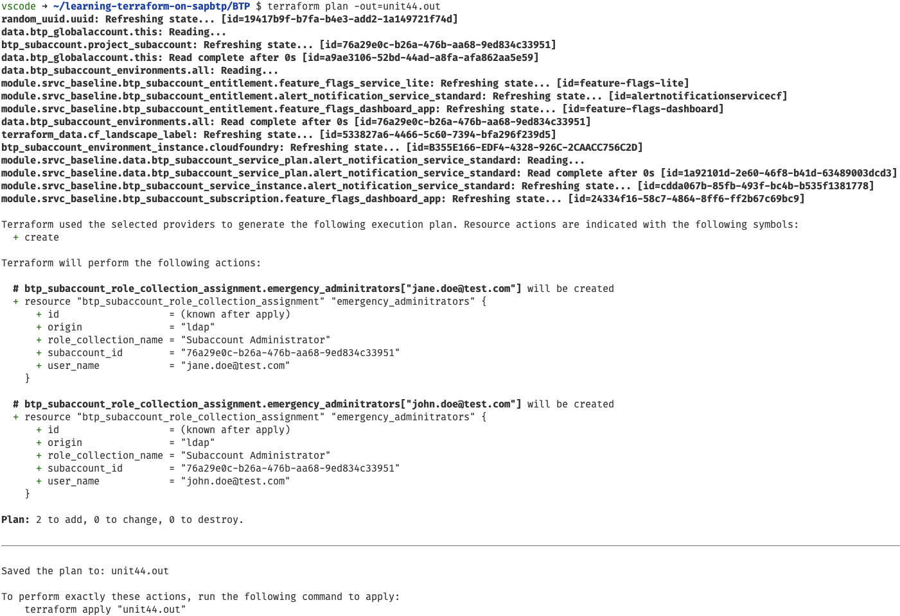
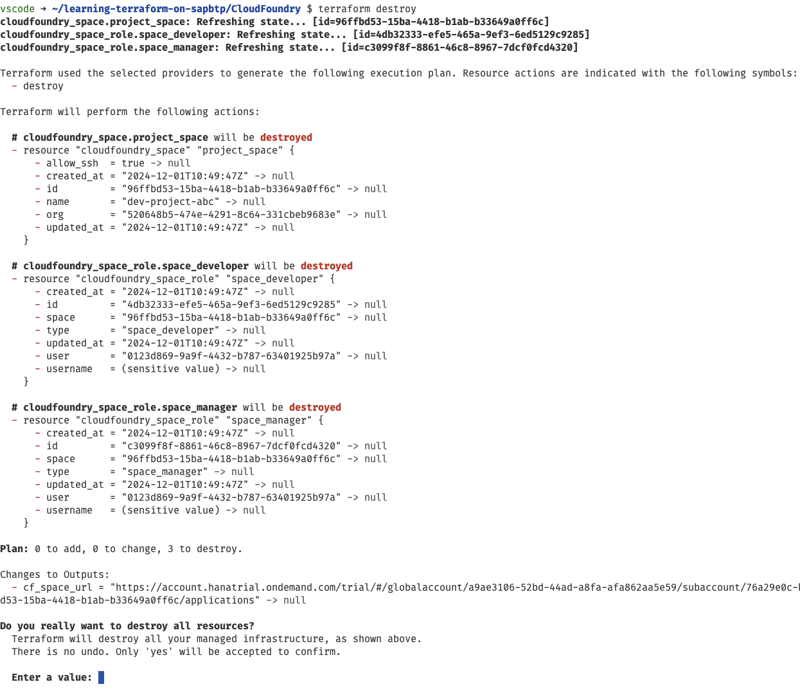
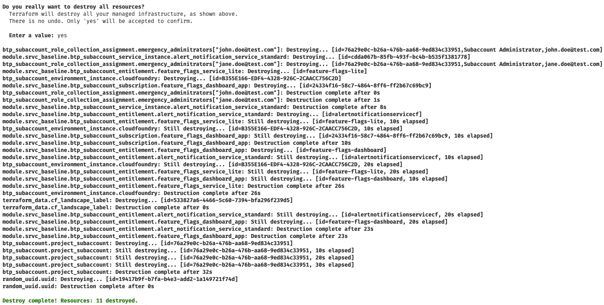

# Lesson 4 Lesson 4 - Iterating over Lists in Terraform

## Goal 🎯

The goal of this lesson is to add emergency admins to the subaccount by assigning the corresponding role collection. In addition we will learn how Terraform can help us to keep the code DRY ("Don't repeat yourself") by leveraging meta arguments of the `resource` block.

## Using meta arguments for iterations 🛠️

### Basics about meta arguments

The requirement we want to cover in this lesson is that whenever a subaccount is created two emergency administrators should be added to the subaccount. This translates to assigning the role collection `Subaccount Administrator` to the users. This can be done via the resource [`btp_subaccount_role_collection_assignment`](https://registry.terraform.io/providers/SAP/btp/latest/docs/resources/subaccount_role_collection_assignment). As we want to assign two users we must add this resource two times.

> [!NOTE]
> In general, the direct assignment of user to role collections is not considered a recomended practise as this makes the lifecacle managament especially the off-boarding flow cumbersome. We recommend to check the recommended practises of the SAP Cloud Identity Service for a sustainable setup. However, for the sake of this lesson we accept this setup.

Let's take one step back as there are some drawbacks here:

- We add the exact same resource twice. The only difference is the user name.
- What if we decide to add another user as emergency administrator? Do we need to continue the copy&paste approach?

That looks a bit fishy. Isn't there a better approach to this like providing a list of users as a variable and then iterate over this list in one resource.

The part of the variable works as we can define complex types like lists, sets etc. (see documentation for [literal expressions](https://developer.hashicorp.com/terraform/language/expressions/types#literal-expressions)). It would be a surprise if there isn't a way in Terraform to then iterate over this list.

And indeed there is. We can use the meta argument [`for_each`](https://developer.hashicorp.com/terraform/language/meta-arguments/for_each) to a resource which iterates over a set or a map. In detail it executes the iteration and for each entry it creates a so called `each` object that consists of a `key` and a `value`. This should help us in fulfilling the requirement. Let's adjust our configuration.

### Adding the emergency administrators to the configuration

First we switch to the `learning-terraform-on-sapbtp/BTP` directory and add the following code to the `variables.tf` file:

```terraform
variable "subaccount_emergency_admins" {
  type        = list(string)
  description = "List of emergency admins for the SAP BTP subaccount"
  default     = []
}
```

This new variable is a list of strings that contains the usernames of the emergency administrators. We default it to an empty list `[]` to make it an optional variable.

> [!NOTE]
> As we want to use the list via `for_each` we cannot set the `sensitive` attribute. Reason is that the sensitive value could be exposed as a resource instance key.

Next we add the values that we want to provide in the `terraform.tfvars` file using dummy values as usernames:

```terraform
subaccount_emergency_admins = ["jane.doe@test.com", "john.doe@test.com"]
```

Now we enhance the configuration in the `main.tf` file by adding the following code:

```terraform
resource "btp_subaccount_role_collection_assignment" "emergency_adminitrators" {
  for_each             = toset(var.subaccount_emergency_admins)
  subaccount_id        = btp_subaccount.project_subaccount.id
  role_collection_name = "Subaccount Administrator"
  user_name            = each.value
}

```

We used the type conversion function [`toset`](https://developer.hashicorp.com/terraform/language/functions/toset) to make a set out of our list. We provide the set as value of the `for_each` meta argument. We then use the `each.value` as input for the `user_name`.

Exactly what we wanted to achieve and we did not have to do unnecessary copy&paste actions. Time for applying the updated configuration.

### Applying the change

You know the drill by now, right? We switch into the directory `learning-terraform-on-sapbtp/BTP` and do the homework first:

```bash
terraform fmt
terraform validate
```

No errors in the validation, then let's move forward and execute the planning:

```bash
terraform plan -out=unit44.out
```

The result should look like this:



Looks as expected, let's apply the change then:

```bash
terraform apply "unit44.out"
```

The result should look like this:


Let us also check the state via:

```bash
terraform state list
```


Interesting. The `each.key` was set to the entry in the list as this should be unique in a set. Good to know.

Mission accomplished, we added the new administrators.

## Summary 🪄

We learned how we can iterate over lists using the Terraform meta argument `for_each` which helps us to keep the code DRY.

And with that ... we have done it all, our first journey with a Terraform configuration is successfully completed 🥳


Maybe there is one more thing that we can do. As we have everything in place we can also do a cleanup and tear everything down again. But how can we do that?

### Cleanup

Terraform offers the [`terraform destroy`](https://developer.hashicorp.com/terraform/cli/commands/destroy) command to tear down the infrastructure. Let's do that as we can anyway rebuild it again. As our setup consists of two part, let us first remove the Cloud Foundry setup.

We switch into the directory `learning-terraform-on-sapbtp/CloudFoundry` and execute the command

```bash
terraform destroy
```

A plan gets calculated and we are prompted if we want to destroy things. We validate the resources that are planned for deletion:



Looks good. We approve it with `yes`:


Part one done. Let's switch to the directory `learning-terraform-on-sapbtp/BTP` and so the same:

```bash
terraform destroy
```

A plan gets calculated and we are prompted if we want to destroy things. At the end we see the number of resources that are planned to be destroyed

```bash
Plan: 0 to add, 0 to change, 11 to destroy.

```

Looks good, but we validated the listed resources. Looks good, so let's confirm with `yes`. This will now take a bit, but at the end we should see the following result:



Now we are really at the end ... happy Terraforming!

## Sample Solution 🛟

You find the sample solution in the directory `units/unit_4_4/solution_u44`.

## Further References 📝

- [Literal expressions](https://developer.hashicorp.com/terraform/language/expressions/types#literal-expressions)
- [Meta argument `for_each`](https://developer.hashicorp.com/terraform/language/meta-arguments/for_each)
- [type conversion function `toset`](https://developer.hashicorp.com/terraform/language/functions/toset)
- [`terraform destroy`](https://developer.hashicorp.com/terraform/cli/commands/destroy)
